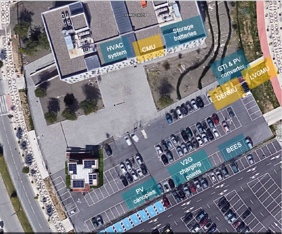

# Maintaining flexibility in smart grid consumption through deep learning and deep reinforcement learning

In the pursuit of transitioning to renewable energy sources, energy flexibility is a crucial element. One of the primary distinctions between traditional fossil fuel-based energy sources and renewable energy sources is that conventional sources are not continuous or programmable. The ability to meet customer demand through the use of energy storage or injection technologies is a significant advancement in the realm of smart grids. This repository offers a solution to the challenge of energy flexibility by showcasing a real system employed in the European E-balance plus project. The system comprises a storage battery, a building that primarily consumes energy for air conditioning, and a V2G (Vehicle-to-grid) electric vehicle charging station capable of both charging and discharging (Figure 1)



**Figure 1**: Ebalance-plus components study case.

## Environment definition

### Consumption increase

$R = \sum_{n}^{i} r_{i} \rightarrow r_{i} = \left\{\begin{matrix}val > 0 & -1\\ val = 0 & 1 \\ val < 0 & \frac{1}{abs(val)}\end{matrix}\right.
\rightarrow val = cons_{exp} - cons_{real}$

### Consumption reduce

$R = \sum_{n}^{i} r_{i} \rightarrow r_{i} = \left\{\begin{matrix}val > 0 & abs(\frac{val}{cons_{real}})\\ val = 0 & 0 \\ val < 0 & -1 \end{matrix}\right.\rightarrow val = cons_{exp} - cons_{real}$

## Install requirements

```python
pip install -r requirements.txt
```

*Note: Please remember that in order to use the GPU, you need to install the supported version of CUDA and CUDNN:* [https://www.nvidia.com/es-es/technologies/cuda-x/](https://www.nvidia.com/es-es/technologies/cuda-x/)

## Training

Customize the training parameters to your preference and specify the scenario type and pre-training model to be employed.

```python
python train.py
```

The fine-tuned model is typically saved in the same directory as the original model by default.

******Note: The models were trained using private consumption data, which can be made available upon request. To adapt the model to a different context or environment that differs significantly, fine-tuning is necessary.******

## Testing

Customize the testing parameters to your preference and specify the scenario type and pre-training model to be employed.

```python
python test.py
```